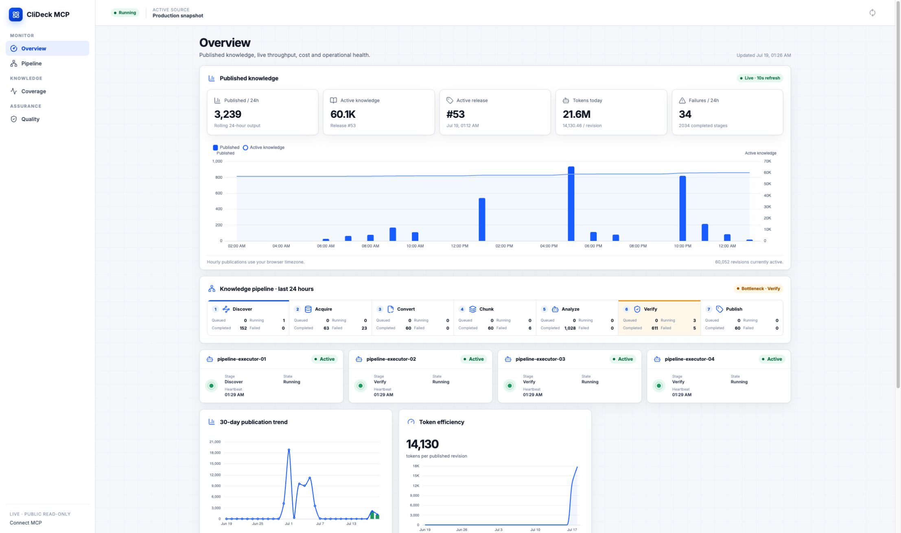

# CliDeck MCP

## Verifiable external memory for AI agents

CliDeck MCP is an open-source framework for building verified, continuously
updated knowledge systems that AI agents can access through MCP.

> **Built with Codex and GPT-5.6.** Codex was the primary engineering
> environment for the project, while GPT-5.6 Luna powers its asynchronous
> knowledge-growth pipeline. Published answers remain deterministic and do not
> call a model at read time.

A model should not have to memorize every version of every technical manual.
It needs strong fundamentals, reasoning ability, and the ability to use tools.
Exact, specialized, and rapidly changing facts can live in an external
knowledge system and be updated without retraining the model.

CliDeck MCP implements this architecture:

- known questions are answered deterministically, without calling an AI model;
- unknown questions become high-priority learning tasks;
- Codex and GPT-5.6 discover and analyze official documentation;
- independent validation passes check applicability and quality;
- new knowledge is published as immutable revisions;
- published knowledge is immediately reusable without AI.

**Network Knowledge** is the first production Domain Pack. **Engineering
Measurements** demonstrates that the same core can support other technical and
scientific domains.

- Public MCP: `https://mcp.clideck.com/mcp`
- Live read-only demo: `https://mcp.clideck.com/demo`
- Product page: `https://clideck.com/software/mcp`
- Code license: Apache-2.0

## Why this project exists

A general-purpose model may understand networking fundamentals while still
having outdated or incomplete knowledge about exact commands, operating-system
versions, restrictions, and operational procedures. Reading hundreds of
manuals during training does not guarantee a precise answer for a particular
device and software release.

CliDeck MCP separates responsibilities:

- the model understands the question, reasons, and selects the appropriate
  tool;
- MCP stores exact, structured, and version-aware knowledge;
- a Domain Pack enforces the rules of its subject area;
- the core manages publication, history, trust, conflicts, and rollback.

This architecture may reduce the need to encode every version of specialized
documentation directly into model weights. We do not claim proven pretraining
cost reductions; that would require separate experiments. The practical
benefit already exists: exact knowledge can be validated and updated
independently of the model.

## What makes CliDeck MCP different

### Deterministic answers

A known question does not invoke an LLM. PostgreSQL performs version-aware
retrieval, the Domain Pack validates the result, and MCP returns a structured
answer.

Known answers are therefore:

- fast;
- repeatable;
- inexpensive;
- verifiable;
- independent of model-generation variance.

If applicable knowledge is unavailable, the system returns `unknown` instead
of guessing.

### Learning from unknown questions

An unknown question becomes a maximum-priority knowledge demand:

```text
Unknown question
      ↓
Official-source discovery
      ↓
Download and deterministic conversion
      ↓
Chunking and extraction
      ↓
Independent verification and Deep Review
      ↓
Immutable publication
      ↓
Instant deterministic reuse
```

A demand is considered learned only after the same deterministic query finds
an active published revision.

### A continuously running Codex knowledge factory

The pipeline runs continuously while enabled. Mechanical stages do not consume
AI tokens:

- downloading;
- PDF, HTML, and text conversion;
- OCR;
- chunking;
- hashing;
- indexing;
- publication.

GPT-5.6 Luna runs through isolated, ephemeral Codex sessions and is used only
for work that requires semantic reasoning:

- discovering official sources;
- analyzing ambiguous material;
- independent verification;
- Deep Review;
- expert tasks.

Up to four isolated executors lease work atomically. The pipeline can be paused
and resumed without duplicating tasks or published knowledge. Routine
discovery, analysis, verification, and Deep Review use GPT-5.6 Luna with low
reasoning effort. Medium reasoning is reserved for unresolved Deep Review
cases, rather than being spent on every record.

### No separate model API integration required

The pipeline can run through an existing authenticated local Codex
installation.

> Runs through your existing local Codex setup. No separate model API
> integration is required. Subject to your Codex plan and usage limits.

This allows developers to use available capacity in their Codex plan to grow a
private or public knowledge system without first integrating and funding a
separate model API.

This is an operating option, not a promise of free or unlimited usage.

## How Codex and GPT-5.6 were used

Codex was not added at the end as a code-generation demo. It was the primary
engineering workspace and collaborator throughout the project, from the first
architecture decisions to the running production system.

During development, Codex and GPT-5.6 were used to:

- translate product goals into the MCP, worker, researcher, and admin
  architecture;
- define trust boundaries, immutable revision contracts, release rollback, and
  privacy controls;
- implement the TypeScript services, PostgreSQL migrations, Domain Pack SDK,
  scaffolder, and local operations dashboard;
- design and test the continuous multi-executor pipeline;
- build security tests, deterministic evaluations, browser tests, and
  production smoke checks;
- inspect real pipeline telemetry and correct throughput, reliability, and
  data-conservation defects;
- create the canonical backup, migration, deployment, health-check, and
  rollback workflow.

Codex and GPT-5.6 are also part of the product's operation:

1. A known question is answered by deterministic PostgreSQL retrieval and
   Domain Pack validation, with no model call.
2. An unknown question creates a prioritized learning demand.
3. Isolated Codex executions pinned to GPT-5.6 Luna
   (`gpt-5.6-luna`) discover official material, analyze ambiguous fragments,
   verify candidates, and perform Deep Review.
4. The core—not the model—enforces schemas, applicability, risk, conflicts,
   provenance, confidence, and immutable publication.
5. Once published, the new answer becomes instantly reusable without another
   GPT-5.6 call.

This separation is deliberate: **Codex and GPT-5.6 propose and review new
knowledge; the deterministic core decides what is allowed to become active
knowledge.** CliDeck MCP is therefore not a wrapper that asks an LLM a question
and trusts whatever text comes back.

### Universal Domain Packs

CliDeck MCP is not limited to network equipment. Subject-specific behavior
lives in Domain Packs.

The core owns:

- immutable revisions;
- releases and rollback;
- provenance;
- confidence thresholds;
- conflict handling;
- audit;
- publication policy.

A Domain Pack defines:

- domain context;
- record types;
- data schemas;
- normalization;
- deterministic validation;
- mapping into a universal knowledge revision.

Developers can scaffold their own pack:

```bash
pnpm domain:create -- --id marine-science --name "Marine Science"
pnpm domain:validate -- --id marine-science
```

The scaffolder creates a manifest, schemas, mapper, fixtures, and tests. Codex
and GPT-5.6 can help adapt a fork to a new subject without rewriting the
trusted publication and release core.

Optional providers can add object storage, spatial data, relation graphs, or
domain-specific laboratory validation.

## Network Knowledge

The first production pack stores network knowledge with explicit context:

- vendor;
- product family and model;
- operating system;
- version scope;
- CLI mode;
- risks and prerequisites;
- verification;
- rollback;
- limitations and conflicts.

The public MCP supports:

- device-context resolution;
- command and diagnostic retrieval;
- complete operational workflows;
- expert research tasks;
- CLI snapshot detection and redaction;
- planned-change review;
- post-change verification;
- upgrade guidance;
- CDP, LLDP, route, traceroute, and topology analysis;
- generic queries across other Domain Packs.

Dangerous commands are not hidden. The system returns the available
information while clearly explaining risk, prerequisites, verification, and
rollback.

Portable software is resolved independently from hardware vendor identity.
ONIE, SONiC, OpenWrt, Debian/Linux tooling, and Cumulus Linux/NVUE knowledge
can therefore be reused across documented platforms. Model and vendor overlays
still take precedence over family-wide records. NX-OS, IOS-XE, Cumulus, and
OpenWrt use explicit version-branch rules: an exact or bounded record wins,
and a nearby patch in the same branch is returned only as a labelled
best-effort fallback. Hardware-sensitive generic answers remain complete but
carry `requires_platform_confirmation` and a stop condition.

Existing immutable revisions are indexed without rewriting their content or
FTS data:

```bash
pnpm knowledge:reindex-applicability -- --resume --verify
```

The command is batched, resumable, checksum-recorded, and idempotent.

CliDeck MCP provides guidance but never connects to a network device and never
executes commands.

## Verifiable knowledge

Every published revision must pass:

- Domain Pack schema validation;
- applicability and version checks;
- deterministic risk classification;
- conflict detection;
- confidence and quality thresholds;
- internal provenance validation;
- additional requirements for dangerous procedures.

An official vendor document is sufficient evidence when a specific fragment
directly supports the published claim.

Published revisions are immutable. Updated information creates a new revision,
while releases allow the active knowledge state to be switched or rolled back
atomically.

## Simple infrastructure

PostgreSQL acts as:

- the knowledge store;
- the full-text search engine;
- the task queue;
- the lease manager;
- the revision store;
- the release engine;
- the audit store.

Redis, a vector database, and an external model API are not required
dependencies.

## Privacy and security

Public MCP responses never expose:

- source URLs;
- manual titles;
- evidence fragments;
- internal source IDs;
- acquisition-pipeline details;
- credentials or access tokens.

Minimal internal provenance remains available to the local `super_admin` for
verification and audit.

Raw CLI is processed in memory. A user example is stored only after explicit
opt-in, redacted again, isolated, and automatically removed after its retention
period. It is never published automatically.

## A truthful public demo

`https://mcp.clideck.com/demo` is not a mock dashboard or a separate marketing
implementation.

The demo uses:

- the same React frontend;
- the same pages;
- the same components;
- the same charts and tables;
- real production counters;
- real pipeline and executor states;
- the same administrative dialogs.

The only differences are enforced by the `public_demo` role:

- source identity and private values are replaced server-side with `XXXXXXXX`;
- final mutations are not sent;
- the database, pipeline, and releases cannot be changed.

Sensitive values are removed by the server, not hidden with CSS blur.



## Current status

The production instance contains more than 66,000 active knowledge revisions.
Live statistics and current pipeline activity are available in the public demo.

The product evaluation suite contains 250 deterministic scenarios. The current
result is:

- 250 passed;
- 0 failed;
- 0 dangerous false-safe results.

Deep Network Pack coverage is currently concentrated on Cisco Catalyst and
IOS-XE. Other vendors can be recognized, but their verified knowledge coverage
varies. The system prefers to return a limitation or `unknown` rather than
generate an unsupported answer.

Production knowledge and third-party documents are not distributed with the
open-source repository. The repository contains the framework, schemas,
scaffolder, tests, and only project-authored or explicitly permitted fixtures.

## Connect

Add the hosted MCP server to Codex:

```bash
codex mcp add clideck --url https://mcp.clideck.com/mcp
codex mcp list
```

Run a local instance:

```bash
cp .env.example .env
pnpm install --frozen-lockfile
docker compose up -d postgres
pnpm db:migrate
pnpm db:seed
pnpm build
pnpm dev:api
```

The local MCP endpoint is:

```text
http://127.0.0.1:8787/mcp
```

CliDeck MCP uses Streamable HTTP and is not limited to CliDeck or Codex
clients. Any compatible MCP client can connect to it.

## Create your own Domain Pack

```bash
pnpm domain:create -- --id marine-science --name "Marine Science"
pnpm install --lockfile-only
pnpm domain:validate -- --id marine-science
pnpm --filter @clideck/domain-marine-science test
```

Read the detailed guides:

- [Domain Pack authoring](docs/DOMAIN_PACK_AUTHORING.md)
- [Adapting a fork with Codex](docs/FORKING_WITH_CODEX.md)
- [Architecture](docs/ARCHITECTURE.md)
- [Security](docs/SECURITY.md)
- [Data and licensing notice](DATA-NOTICE.md)

## License and data

Apache-2.0 applies to the source code and project-authored sample fixtures.

It does not automatically grant rights to:

- third-party documents;
- production knowledge;
- private manuals;
- user data;
- datasets imported by an operator.

See [DATA-NOTICE.md](DATA-NOTICE.md) for details.
