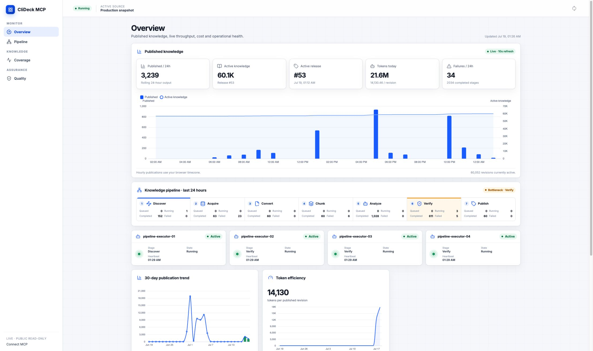

# CliDeck MCP

An open-source framework for version-aware, source-backed knowledge that AI
agents query through MCP. Known answers use deterministic PostgreSQL retrieval;
incomplete answers create durable research demands. Isolated Codex runs discover
and extract evidence; the core validates and publishes immutable revisions.
CliDeck provides guidance and never connects to devices or executes commands.

| Surface | URL |
| --- | --- |
| Public Streamable HTTP MCP | https://mcp.clideck.com/mcp |
| Network Evidence Workbench | https://mcp.clideck.com/webmcp |
| Live read-only operations demo | https://mcp.clideck.com/demo |
| Product page | https://clideck.com/software/mcp |

## Capabilities

- **Network Knowledge:** device context, commands, workflows, snapshots and
  redaction, change review, verification, upgrades, topology and expert tasks.
  Exact context ranks first; broader guidance is labelled and unsupported
  questions remain `unknown`. Coverage varies by vendor, platform and version.
- **Domain Packs:** subject-specific schemas and deterministic validation over
  the shared revision/release core. Engineering Measurements demonstrates exact
  decimal values, units and tolerances outside networking.
- **Continuous research:** 1–8 enabled isolated executors, independent Luna/High
  models and official price comparison in `/admin/models`; downloads, conversion,
  OCR, chunking, indexing and publication are mechanical. AI receives bounded
  tasks through the researcher bridge. See [model policy](docs/RESEARCHER_AUTOMATION.md).
- **WebMCP:** six typed browser tools share a versioned case with the engineer.
  Complete files stay local; selected evidence is redacted before transmission.
  Browser-agent evidence access requires explicit opt-in. Manual controls work
  without WebMCP. See [contract and walkthrough](docs/WEBMCP.md).
- **Operations demo:** `/admin` and `/demo` use the same frontend and real
  production counters. Server-side projections redact private data; demo
  controls cannot mutate production.



Live totals are available in the demo and `/public/v1/stats`; historical counts
and test results are not current service guarantees. Codex was the primary
engineering environment. Pipeline use through a local authenticated Codex
installation needs no separate model API integration and remains subject to
plan and usage limits.

## Run locally

Requirements: Node.js 24, pnpm as pinned in `package.json`, PostgreSQL 16
(Docker Compose is provided).

```bash
cp .env.example .env
set -a
source .env
set +a
pnpm install --frozen-lockfile
docker compose up -d postgres
pnpm db:migrate
pnpm db:seed
pnpm knowledge:reindex-applicability -- --resume --verify
pnpm build
pnpm dev:api
```

Edit `.env` for your local database before sourcing it. MCP listens at
`http://127.0.0.1:8787/mcp`. Worker/researcher entry points and all supported
commands are in `package.json`. Production uses the
[canonical deployment workflow](docs/OPERATIONS.md).

To connect the hosted service with the Codex CLI:

```bash
codex mcp add clideck --url https://mcp.clideck.com/mcp
codex mcp list
```

Other Streamable HTTP MCP clients can use the same endpoint.

## Develop

```bash
pnpm check
pnpm test
pnpm eval
pnpm build
```

PostgreSQL integration tests and the 250-case evaluation need a migrated,
seeded test database. A run that skips DB tests is not full release validation;
the deploy script provisions its own disposable database and applies grants.

Create a pack:

```bash
pnpm domain:create -- --id marine-science --name "Marine Science"
pnpm install --lockfile-only
pnpm domain:validate -- --id marine-science
pnpm --filter @clideck/domain-marine-science test
```

See [agent rules](AGENTS.md), [documentation map](docs/README.md),
[architecture](docs/ARCHITECTURE.md), [pack authoring](docs/DOMAIN_PACK_AUTHORING.md)
and [security](docs/SECURITY.md).

## License and privacy

Apache-2.0 covers code and project-authored fixtures, not production knowledge,
third-party manuals or user data. Internal evidence and secrets stay private.
The dedicated provenance tool exposes only allowlisted metadata for active
revisions; the operations demo retains its stricter redaction boundary.
See [DATA-NOTICE.md](DATA-NOTICE.md).
